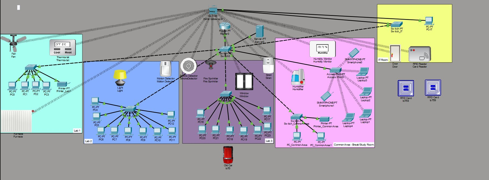
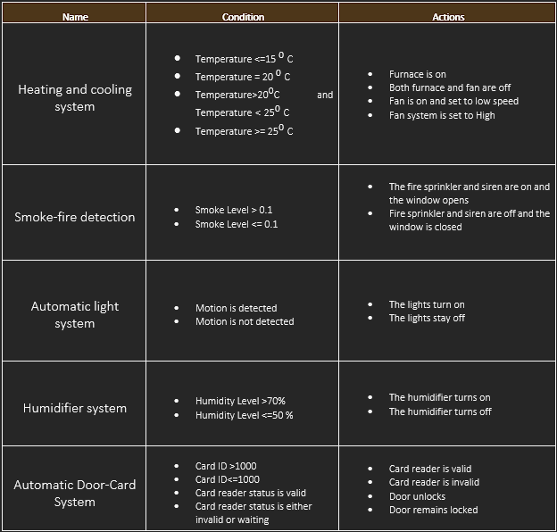

# Smart Campus Infrastructure

This project presents a proposal for transforming a mid-sized university into a smart campus using networking infrastructure and Internet of Things (IoT) technologies.
The system was designed and implemented using Cisco Packet Tracer and demonstrates how modern campus environments can integrate smart devices, sensors and automated systems to improve security, environmental control and user experience.

## Network Topology
The smart campus infrastructure consists of multiple rooms connected through a structured network architecture.
Each room is connected to a local switch, which then connects to a main switch and finally to a central router, enabling communication between all devices in the campus network. Each computer in the network is assigned a static IP address for easier monitoring and management.

## Campus Structure
The virtual campus environment includes:
-Three laboratories
-One common student area/study room
-One IT control room
Each area contains computers and smart devices connected to the campus network.

## IoT Systems Implemented
The smart campus integrates several IoT systems designed to automate building management and improve campus functionality.

Heating and Cooling System:
The first laboratory includes an automated temperature control system.
The system works based on the temperature measured by a thermostat:

-If temperature ≤ 15°C → the heating system turns on
-At 20°C → both heating and fan systems turn off
-If temperature is between 20°C and 25°C → the fan operates at low speed
-If temperature ≥ 25°C → the fan operates at high speed

## Automatic Lighting System
The second laboratory includes a motion-based lighting system.
-When motion is detected → the lights turn on
-When no motion is detected → the lights turn off
This system helps reduce energy consumption.

## Fire Detection and Safety System
The third laboratory includes a fire safety automation system.
The system contains:
-Smoke detector
-Alarm siren
-Fire sprinkler system
-Automatic window
If the smoke level exceeds 0.1:
-the siren is activated
-the fire sprinkler system activates
-the window automatically opens
If the smoke level is 0.1 or lower:
-the sprinkler and siren turn off
-the window remains closed.

## Humidity Control System
The common student study area contains a humidity monitoring system connected to a humidifier.
The system operates as follows:
-If humidity > 70% → the humidifier turns on
-If humidity ≤ 50% → the humidifier turns off
This helps maintain a comfortable environment for students.

## RFID Access Control System
The IT control room includes a smart door security system with an RFID card reader.
The system has three statuses:
-Valid
-Invalid
-Waiting
The door unlocks only when the card ID is greater than 1000.
If the card ID is 1000 or lower, the door remains locked.

## IoT Automation Rules

The table below summarizes the automation rules used by the IoT devices in the smart campus system, including temperature control, motion detection, fire safety and RFID access control.

## System Testing
To verify that the system works correctly, several tests were performed.
First, the network connectivity was tested by sending ping requests between computers using their IP addresses.
Then the IoT devices were tested using different triggers, such as:
-generating smoke to activate the fire detection system
-creating motion near the motion sensor
-adjusting temperature and humidity levels
-scanning RFID cards at the door reader
All systems responded correctly according to the predefined conditions.

## Future Improvements
Future improvements for the smart campus could include:
-smart parking systems
-campus transportation tracking
-virtual reality classrooms
-improved cybersecurity and encryption systems
-accessibility technologies for students with disabilities.

